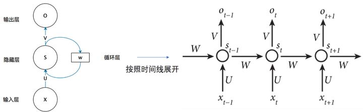
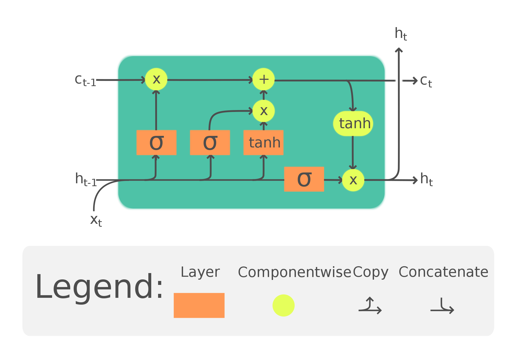
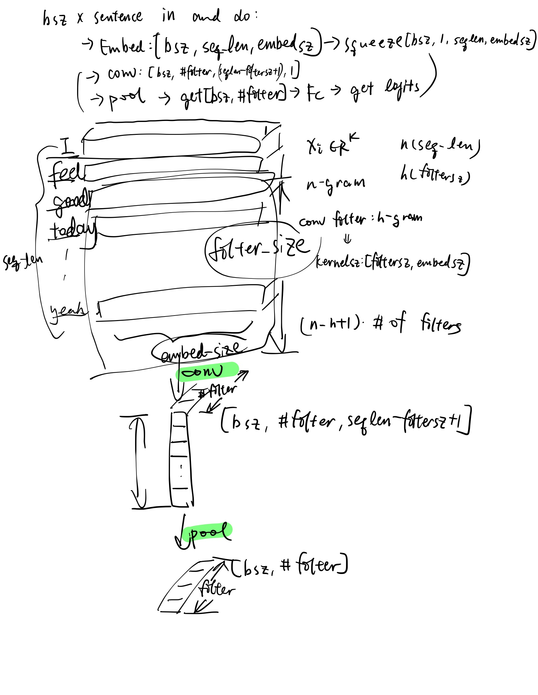

---
# PyTorch Basic Experiments

### 1: PyTorch Basic operations

pytorch框架与autograd入门，简单前向神经网络

#### 套路
1. 定义输入输出
2. 定义模型
3. 定义loss function
4. 定义optimizer
5. 定义训练过程：获得模型预测，做loss，清理梯度，反向传播，更新参数

### 2: Simple Word Embedding Experiment

Word2vec：Skip-Gram模型，基于分布式假设

假任务：用中心词的词向量预测附近词的词向量（这样我们就知道这个词是什么）

真任务：用上面训练出的参数获得词向量

目标函数：一个对数概率和，sigma(log(p(w_t+j | wt)))这样，其中概率密度由一个softmax给出：p(o | c)=exp(u_o^T·v_c)/sigma(exp(u_w^T·v_c))，这个点积越大概率就越大

缺陷：比如词向量空间维度有50w，那每次进来一个词向量都要和这50w维做一次点积！太惊人了。

eg. 有50000个词，input embedding:50000 * 100（即用一个100维的vec表征一个word）, output embedding:50000 * 100, 模型参数就是这些embeddings，是要学习的；在我们优化目标函数（假目标）的过程中，真参数这些embeddings就被学习出来了。事实上，我们最后选用input embedding作为结果词向量，论文作者说这样效果好一点XD

改进：负例采样（negative sampling）一个正样本，V-1个负样本（采样得到，子空间），优化的是正样本的点积和负样本的负点积的联合和。

---

### 3: Simple Language Model Experiment

如何写一个循环神经网络

#### 语言模型

预测一句话出现的概率有多大

- $P(W)=P(w_1,w_2,w_3,...,w_n)=\Pi P(w_i|w_1...w_i-1)$

可以完成：完型填空，文本生成...

##### markov假设

每个单词只跟它前n个单词有关

##### 语言模型评价

Perplexity

- 即概率本身的-1/N次方$PP(W)=P(W)^{-1/N}$，N可以起到一个normalization factor的功能，把句子长度的影响给取消
- PP越高，模型越不好

#### 循环神经网络

循环神经网络相比普通的神经网络，能更好照顾序列信息（因为把前一时刻的隐层权重用在此时的预测）

(图片来自知乎高赞回答《一文搞懂RNN（循环神经网络）基础篇》)

- U是输入到隐层的权重，V是隐层到输出的权重，W是上一时刻t-1隐层值和当前t时刻权重中间用来线性变换的关系矩阵
- $O_t=g(V\cdot S_t),S_t=f(U\cdot X_t+W\cdot S_{t-1})$ St depends on both St-1 & Xt

损失函数：预测序列上的cross entropy

#### LSTM

改进版RNN，主要解决长序列训练时的梯度爆炸和梯度消失问题

在RNN隐状态$h_t$上还有一个隐状态$c_t$要传递，它负责主线的遗忘与记忆

（图片来自维基百科）

----

### 4: Text Classification Experiment

#### word averaging

词——词向量——做平均——线性分类（比如两层神经网络）

简单但高效

#### RNN

用RNN模型encode这个句子，把传到最后的隐状态作为encode

#### CNN

----

### 5: CNN and Finetuning Experiment

#### CNN

用卷积神经网络进行局部特征提取

相较于全连接层的平移不变性：比如图片的不同位置，在fc层是由不同参数做inference的，而卷积的filter是平移来做，是全局共享的，因此对位置不敏感，处理图像更方便（但是卷积无法处理旋转，因为filter常常是正方的

大致结构：INPUT → [[CONV → RELU] * N → POOL ] * M → [FC → RELU] * K → FC

Batch normalization: 拿到一个batch数据，求均值和标准差，对每个样本标准化，使之以0为中心，以1为标准差

LeNet, AlexNet跟上述大体结构差不多

deeper：VGG-16

##### ResNet

basic block中有residual过程，即在最后做addition（与输入相加）

更深情况：bottleneck，basicblock中2*conv→3*conv，此外addition时有一个downsample

##### DenseNet

能达到更深

考虑denseblock：随层数变深，conv2的size有一个growth_rate因子让它更大，然后把得到的new_feature和之前的feature拼在一起

##### Transfer Learning

使用预训练模型来加速训练过程，预训练模型的靠前的层是非常好的feature extractor！

两种方法：

- fine tuning：改变一些模型架构，比如把最后fc层的一千类改成二分类，然后继续训练整个模型上的参数
- feature extraction：不改变预训练模型结构的参数，只更新我们自己加的部分模型参数

press: MNIST数据集基础上有个fashion_mnist！也是十分类问题，内容是各种黑白的衣着服饰。

----